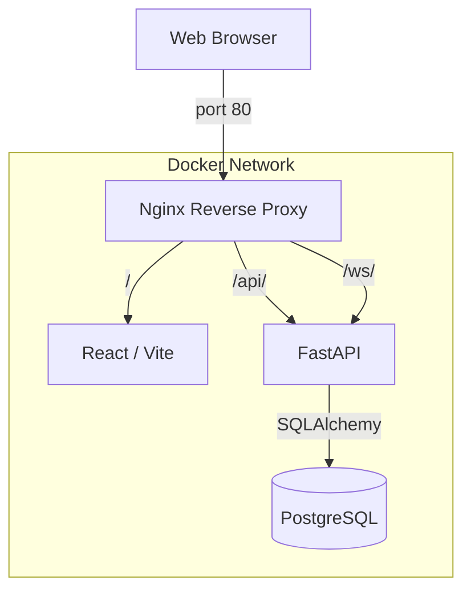

# WaveChat System Architecture

This document describes the high-level architecture and data flow of WaveChat.

## 🏗 Component Diagram

## 📋 Components Detail

### 1. Nginx Gateway
The entry point for all traffic. It provides:
- **Routing**: Separates frontend, backend API, and WebSocket traffic.
- **WebSocket Support**: Handles the HTTP 1.1 `Upgrade` and `Connection` headers required for persistent socket connections.
- **Abstraction**: The client only ever talks to one IP/domain on port 80.

### 2. Frontend (React + Vite)
- **Role**: User Interface and client-side logic.
- **Stack**: Bootstrap for layout, native `WebSocket` API for real-time, and `fetch` for chat history.
- **Build**: Multi-stage Docker build that compiles the React app into static files and serves them via Nginx.

### 3. Backend (FastAPI)
- **Role**: Business logic, WebSocket management, and Database abstraction.
- **WebSocket Manager**: Maintains a list of active connections and broadcasts incoming messages to all connected clients.
- **Persistence Logic**: Every message received over a socket is validated via Pydantic and saved to Postgres before being broadcast.

### 4. Database (PostgreSQL)
- **Role**: Persistent storage for chat logs.
- **Health Checks**: The `docker-compose` file ensures the database is fully ready ("healthy") before the backend starts up to prevent connection errors.

## 🔄 Data Flows

### Message Send Flow
1. **User** types a message and hits 'Send'.
2. **Frontend** sends a JSON string over the established WebSocket.
3. **Nginx** receives the frame and forwards it to the **Backend**.
4. **Backend** parses the JSON, creates a database entry via **SQLAlchemy**.
5. **Postgres** confirms storage.
6. **Backend** broadcasts the new message (including its DB ID and timestamp) to **all connected clients**.
7. **All Clients** receive the message and update their local state/UI.

### Initialization Flow
1. **User** loads the page.
2. **Frontend** requests `/api/messages`.
3. **Backend** queries **Postgres** for existing messages.
4. **Backend** returns the list; **Frontend** renders the chat history.
5. **Frontend** establishes the WebSocket connection for future messages.
